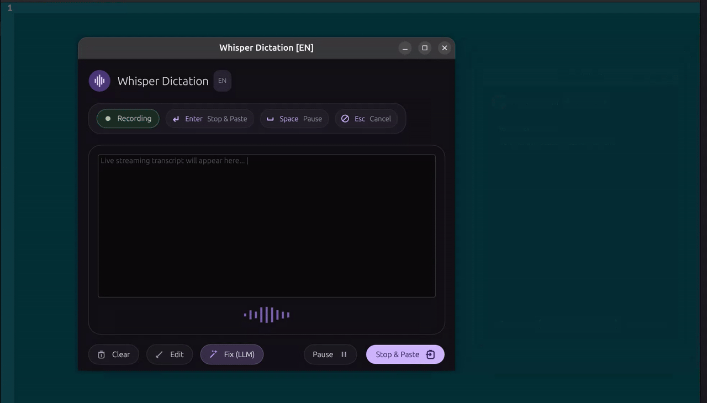
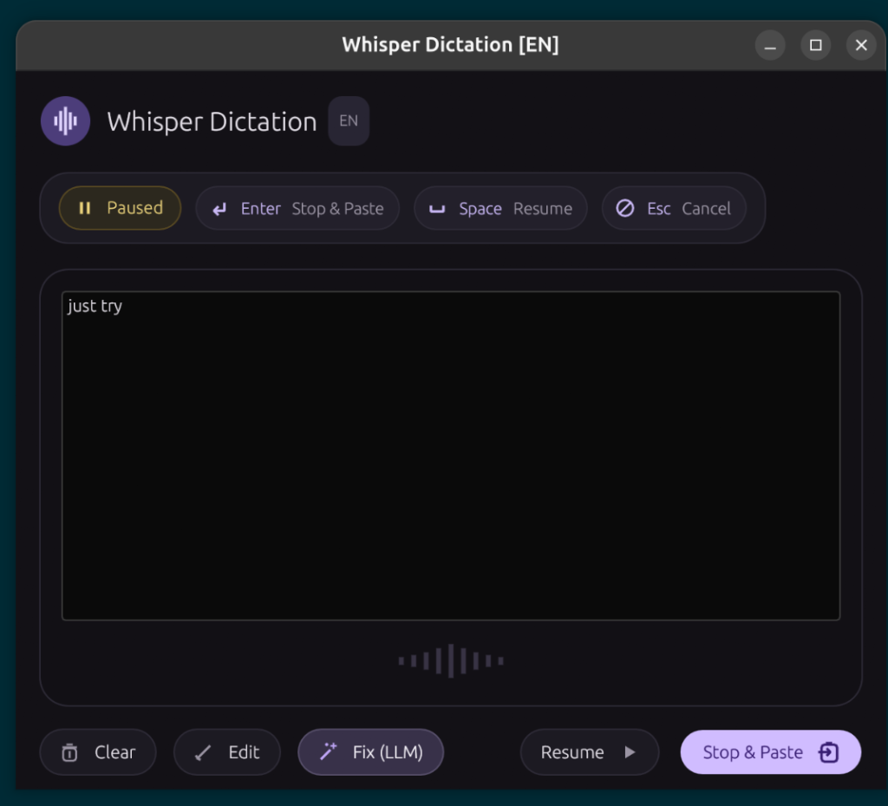

# Whisper-NPU 🎙️⚡

> **Fast, private, offline voice dictation overlay for Linux (Wayland & GNOME) powered by ONNX Runtime, Sherpa-ONNX, and Rust.**

<p align="center">
  
  <br>
  <em>Live dictation, LLM fix sidecar, and automated Wayland paste. (<a href="assets/demo.webm">Watch High-Res WebM Video</a> | <a href="assets/app_screenshot.png">View Screenshot</a>)</em>
</p>

Whisper-NPU provides a lightning-fast floating voice dictation overlay that transcribes your speech in real-time and automatically pastes the text directly into whichever application you are using—whether it's VS Code, a web browser, terminal, or chat client.

---

## ✨ Highlights

* **100% Offline & Private:** Dictation runs entirely locally on your machine using quantized INT8
  `distil-whisper-large-v3` weights. No audio or text ever leaves your device.
* **Instant Paste (`Ctrl+V`):** When you finish dictating (by pressing `Enter`), the overlay closes
  and automatically injects the text into your active cursor position using `ydotool` and
  `wl-clipboard`.
* **Persistent Always-on-Top Overlay:** Sleek Material Design 3 dark interface that remains pinned
  above all windows even while switching focus.
* **Fix with LLM Sidecar:** One-click auxiliary window that lets you dictate instructions (e.g., *"
  Make this sound professional"* or *"Fix punctuation"*) to polish your text using a local LLM
  before pasting.
* **Audio Feedback Protection:** Integrates with PipeWire (`wpctl`) to automatically mute laptop
  speakers during speech capture, eliminating audio feedback loops.
* **Full Keyboard Control:**
    * **`Space`**: Pause / Resume recording
    * **`Enter`**: Finalize dictation, copy to clipboard, and paste into active window
    * **`Esc`**: Cancel dictation and dismiss overlay
    * **`Edit` Mode**: Edit transcribed text directly before pasting

---

## 🏗️ Architecture

Whisper-NPU uses a split client-daemon architecture connected via a high-speed Unix domain socket (
`/run/whisper-npu/daemon.sock`):

```
                        ┌───────────────────────────────────────────────┐
                        │             Microphone Audio Input            │
                        │       arecord (16 kHz S16_LE mono PCM)        │
                        └──────────────────────┬────────────────────────┘
                                               │
                                               ▼
                        ┌───────────────────────────────────────────────┐
                        │        whisper-daemon (Background Svc)        │
                        │  • Automatic speaker muting via wpctl         │
                        │  • sherpa-rs + distil-whisper-large-v3 INT8   │
                        │  • IPC Unix Socket (/run/whisper-npu/...)     │
                        │  • Direct wl-copy & ydotool Ctrl+V injection  │
                        └──────────────┬─────────────────▲──────────────┘
                          Events (JSON)│                 │Commands (JSON)
                                       ▼                 │
                        ┌────────────────────────────────┴──────────────┐
                        │          whisper-client (GUI Overlay)         │
                        │  • egui / eframe Material Design 3 dark UI    │
                        │  • Reactive soundwave animation               │
                        │  • Persistent always-on-top via wmctrl        │
                        │  • Auxiliary "Fix with LLM" sidecar viewport  │
                        └───────────────────────────────────────────────┘
```

1. **`whisper-daemon`:** A lightweight background service that keeps the Whisper ONNX model warm in
   memory. It manages audio capture, speaker muting, inference, and the automated paste sequence.
2. **`whisper-client`:** A GPU-accelerated desktop overlay written in `egui` that displays live
   streaming partial transcripts and keyboard controls.

---

## 📋 System Requirements

* **OS:** Linux (Ubuntu 22.04+, Debian 12+, Fedora, Arch)
* **Desktop Environment:** Wayland (GNOME Shell recommended) or X11
* **Audio Server:** PipeWire (with `wireplumber`) or ALSA
* **Rust:** 1.80+ (`cargo`, `rustc`)

---

## 🚀 Quick Start

### 1. Install System Dependencies

```bash
sudo apt update && sudo apt install -y \
  build-essential cmake pkg-config git curl wget clang \
  libasound2-dev alsa-utils pipewire wireplumber libssl-dev \
  libwayland-dev wayland-protocols libxkbcommon-dev libgl1-mesa-dev \
  wmctrl wl-clipboard ydotool
```

### 2. Configure `ydotool` (Virtual Keystrokes)

Start the `ydotoold` daemon (required for simulating `Ctrl+V`):

```bash
# Launch daemon with user permissions
sudo ydotoold --socket-path=/tmp/.ydotool_socket --socket-perm=0666 &

# Set environment variable
echo 'export YDOTOOL_SOCKET="/tmp/.ydotool_socket"' >> ~/.bashrc
export YDOTOOL_SOCKET="/tmp/.ydotool_socket"
```

### 3. Install ONNX Runtime

Download and configure the official Microsoft ONNX Runtime binaries:

```bash
sudo mkdir -p /opt/onnxruntime
cd /tmp
wget https://github.com/microsoft/onnxruntime/releases/download/v1.19.2/onnxruntime-linux-x64-1.19.2.tgz
tar -xzvf onnxruntime-linux-x64-1.19.2.tgz
sudo cp -r onnxruntime-linux-x64-1.19.2/* /opt/onnxruntime/
rm -rf onnxruntime-linux-x64-1.19.2*

echo "/opt/onnxruntime/lib" | sudo tee /etc/ld.so.conf.d/onnxruntime.conf
sudo ldconfig

echo 'export ORT_LIB_LOCATION=/opt/onnxruntime/lib' >> ~/.bashrc
export ORT_LIB_LOCATION=/opt/onnxruntime/lib
```

### 4. Download Models

Clone the repository and run the model download script:

```bash
git clone https://github.com/<your-username>/whisper-npu.git
cd whisper-npu

chmod +x scripts/download_model.sh
./scripts/download_model.sh
```

### 5. Build

Compile all workspace crates in release mode:

```bash
cargo build --release
```

---

## 🏃 Running Whisper-NPU

### Option A: Systemd Service (Recommended)

Run the daemon in the background as a system service so the model remains loaded:

```bash
# Enable and start the daemon service
sudo cp whisper-daemon.service /etc/systemd/system/
sudo systemctl daemon-reload
sudo systemctl enable --now whisper-daemon.service

# Verify it is active
systemctl status whisper-daemon.service
```

Launch the GUI overlay whenever you want to dictate:

```bash
./scripts/run_client.sh
```

> **Tip:** In GNOME Settings → **Keyboard** → **Keyboard Shortcuts** → **Custom Shortcuts**, bind
`./scripts/run_client.sh` to a key combination like `Super + D` or `Ctrl + Space` for instant access
> anywhere!

---

### Option B: Quick Manual Launch (Development)

Run both daemon and client together using the top-level launcher:

```bash
./run.sh
```

---

## 🎯 How to Use

<p align="center">
  
</p>

1. **Activate the Overlay:** Press your custom shortcut (or run `./scripts/run_client.sh`).
2. **Speak Naturally:** Dictate your thoughts. Speech is transcribed and displayed live in
   real-time.
3. **Control Recording:**
    * Press `Space` to pause or resume recording.
    * Click `[Clear]` to wipe the text and start over.
    * Click `[Edit]` to make manual keyboard corrections (recording auto-pauses while editing).
4. **Fix with LLM (Optional):** Click `[Fix]` to open the auxiliary sidecar window. Dictate a
   prompt (e.g. *"Fix typos and make it bullet points"*), hit `Enter`, review the AI response, and
   hit `Enter` again to apply.
5. **Paste Anywhere:** Press `Enter`. The overlay disappears instantly and your text is pasted
   directly into your active window.

---

## 📂 Project Structure

```
whisper-npu/
├── Cargo.toml                  # Workspace configuration
├── README.md                   # Project overview & documentation
├── dependency_check.md         # Environment verification script
├── dependency_install.md       # Detailed package setup guide
├── project_flow.md             # Architecture & UI specifications
├── workflow.md                 # Development log & engineering notes
├── whisper-daemon.service      # Systemd service definition
├── run.sh                      # Development launcher
├── scripts/
│   ├── download_model.sh       # Downloads distil-whisper ONNX weights
│   ├── run_daemon.sh           # Daemon startup wrapper
│   └── run_client.sh           # Client startup wrapper
├── models/                     # INT8 quantized ONNX models
└── crates/
    ├── protocol/               # Shared IPC schemas (ClientCommand, DaemonEvent)
    ├── daemon/                 # Audio capture, whisper inference, paste engine
    └── client/                 # Material Design 3 GUI, soundwave, fix sidecar
```

---

## 🛠️ Verification & Tests

To run the full suite of automated unit and integration tests:

```bash
cargo test
```

To run the dependency verification script:

```bash
bash dependency_check.md
```

---

## 📄 License

Licensed under the [Apache License, Version 2.0](LICENSE) or [MIT License](LICENSE).

---

> Whole project is generated by **Antigravity 2.0** without programming knowledge of Rust.

